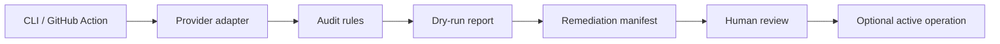

# CloudCull

> Cloud cost audit prototype with dry-run reporting, provider adapters, remediation manifests, and a dashboard demo.

[](https://github.com/daretechie/cloudcull/actions/workflows/cull_report.yml)
[](https://daretechie.github.io/cloudcull/)
[](https://opensource.org/licenses/MIT)

CloudCull explores a practical DevOps problem: cloud resources, especially GPU instances, can keep running after they are no longer useful. The safe first step is not automatic deletion. It is a reviewable audit report that shows what was found, why it looks wasteful, and what action should be taken next.

## Current Scope

This repository is an AI-assisted prototype, not a production FinOps platform.

It is designed to:

- run cost-audit checks from a CLI or GitHub Actions workflow;
- support dry-run reporting before any active operation;
- separate provider adapters from reporting logic;
- write remediation manifests for human review;
- show audit output in a lightweight dashboard demo.

It is not claiming:

- hands-off production remediation;
- guaranteed savings;
- real-time multi-cloud governance;
- enterprise-grade controls;
- deletion or stop actions without review.

The strongest engineering signal here is the orchestration shape: provider discovery, pre-flight checks, parallel classification, report generation, remediation manifest output, optional active remediation, and metrics export.

## Architecture



## Tech Stack

| Area | Tools |
|---|---|
| CLI / audit logic | Python |
| Cloud adapters | AWS, Azure, GCP-oriented modules |
| Automation | GitHub Actions |
| Packaging | Docker, Docker Compose |
| Dashboard | React / Vite |
| Security check | Bandit |

## How to Run

Recommended runtime: Python 3.12+.

```bash
git clone https://github.com/daretechie/cloudcull.git
cd cloudcull
uv sync
./scripts/demo.sh
```

Docker:

```bash
docker build -f infra/Dockerfile -t cloudcull .
docker run --env-file .env cloudcull --simulated --dry-run
```

## Active Operations Boundary

Use active operations only after a dry run has been reviewed. `--active-ops` is a prototype safety boundary, not a production automation guarantee.

```bash
uv run cloudcull --region us-east-1 --active-ops --no-dry-run
```

Before using active operations in a real account, add and verify:

- a least-privilege IAM or cloud-provider policy;
- a redacted sample report;
- an approval step;
- a rollback or recovery note;
- logs proving exactly what action was taken.
- Terraform backend locking and environment-specific validation;
- a plan for false positives, remote state access, and concurrent runners.

See [Terraform state semantics](docs/terraform_state.md) before using any state-removal workflow.

## Operational Definitions

- A `ZOMBIE` result means CloudCull found a candidate for review based on low utilization signals and provider metadata. It is not proof that a resource is safe to stop.
- Classification currently uses provider-backed LLM prompts plus simulated and unit-level tests. Production readiness would require a labeled evaluation set and precision/recall tracking across AWS, Azure, and GCP.
- `terraform state rm` removes a resource from Terraform state. It does not destroy the cloud resource. CloudCull's active flow attempts a cloud stop/deallocate first, then removes state only when it can resolve a Terraform address.

More detail:

| Topic | Document |
|---|---|
| Classification criteria and evaluation gaps | [Classification model](docs/classification.md) |
| Terraform state behavior and limits | [Terraform state semantics](docs/terraform_state.md) |
| Security guardrails | [Security internals](docs/security_internals.md) |
| Operations notes | [Operations guide](docs/operations.md) |

## What AI Helped Me Build Here

AI assistance helped accelerate the first pass of the product framing, provider abstractions, LLM-provider scaffolding, dashboard copy, and remediation flow shape. The parts that matter most for review are the implementation details in the code: dry-run defaults, adapter separation, pre-flight checks, structured manifests, metadata scrubbing, explicit active-operation flags, and tests around parsing and remediation behavior.

## Evidence To Add

| Evidence | Status |
|---|---|
| Dry-run output with redacted cloud fixture | Needed |
| Example remediation manifest | Needed |
| GitHub Actions audit run screenshot | Needed |
| Least-privilege policy for each provider | Needed before production claims |
| Dashboard screenshot | Demo available, screenshot should be committed |

## Repository Orientation

| Directory | Purpose |
|---|---|
| `src/` | Python modules, adapters, and CLI entrypoint |
| `infra/` | Docker and deployment-related files |
| `config/` | Configuration and generated manifests |
| `scripts/` | Demo and utility scripts |
| `docs/` | Architecture, setup, operations, and security notes |
| `tests/` | Unit and integration tests |
| `dashboard/` | Dashboard demo |

## Security Checks

```bash
uv run bandit -c pyproject.toml -r .
```

## Notes For Reviewers

This project is intentionally framed as a prototype. The important engineering signal is the safety model: dry-run first, manifest output, human review, and explicit limits around active operations.
