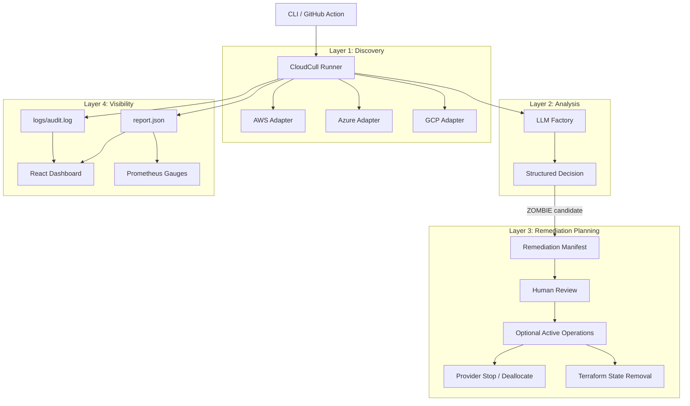

# CloudCull Architecture

## Overview

CloudCull is a CLI-first cloud cost audit prototype. It discovers candidate GPU instances, classifies them with a configured analysis provider, renders a report, writes remediation artifacts, and can optionally run active remediation behind explicit flags.

The dashboard is a read-oriented surface for reviewing generated audit output. The CLI remains the primary control path.

## System Design

## Core Components

### 1. Provider Adapters (`src/adapters/`)

All providers implement a shared adapter shape for scanning, connection verification, attribution lookup, and optional stop/deallocate behavior. The adapter layer keeps provider SDK differences away from the runner.

### 2. Analysis Providers (`src/llm/`)

`LLMFactory` selects among the implemented providers, including simulated mode for local demos and tests. The provider contract returns structured decisions with reasoning and confidence.

This is a classification aid, not a proven production classifier. See [classification.md](classification.md) for the current evaluation boundary.

### 3. Pre-flight Checks

The runner validates basic readiness before scanning non-simulated environments:

- analysis provider initialization;
- Terraform binary availability for remediation paths;
- cloud adapter connectivity.

Adapters that fail connection checks are removed from the run. If no healthy adapters remain, the runner exits.

### 4. Identity Attribution

Provider adapters attempt to attach launch attribution where available:

- AWS CloudTrail `RunInstances` events;
- Azure Activity Log write operations;
- GCP Audit Log insert operations.

Attribution is useful for review and cost ownership, but it should not be treated as complete proof in production without log-retention checks.

### 5. Remediation Engine

The remediation engine generates a structured manifest and Terraform-oriented actions for review. Active operations are opt-in and attempt this sequence:

1. stop or deallocate the cloud resource through the provider SDK;
2. resolve the Terraform state address by resource type and physical ID;
3. back up local `terraform.tfstate` when present;
4. run `terraform state rm <address>` with `shell=False`.

See [terraform_state.md](terraform_state.md) for what state removal does and does not do.

### 6. Observability

The runner writes JSON reports and updates Prometheus gauges for candidate count and estimated savings. Logs rotate through `RotatingFileHandler`.

## Design Principles

## 1. CLI-First and Pipeline-Ready

CloudCull is intended to run from a terminal, CI job, or scheduled workflow. The JSON output can be consumed by dashboards, scripts, or notification systems.

## 2. Dry-Run First

Dry-run reporting is the default behavior. Active operations require explicit flags and, unless bypassed for tests, an operator confirmation.

## 3. Provider Isolation

Cloud provider APIs differ in authentication, metric shape, pagination, and error handling. Keeping those details in adapters makes the runner easier to reason about.

## 4. Reviewable Remediation

CloudCull writes remediation manifests before taking action. This makes the intended operation inspectable and easier to test.

## 5. Model Independence With Guardrails

The factory pattern allows different analysis providers, but provider choice is not a substitute for evaluation. Production use needs labeled data, false-positive controls, deterministic checks, and human approval.

## 6. Dashboard as Review Surface

The dashboard should help reviewers inspect results. It should not be treated as proof that remediation is safe.
